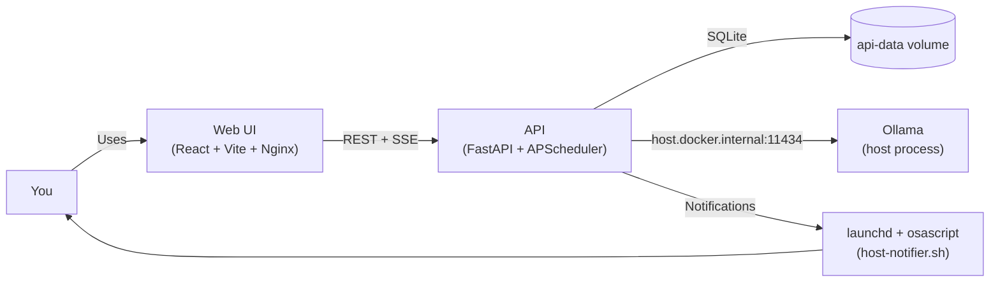

# Resolution Tracker

A local-first fitness resolution tracker that pairs a hardened FastAPI backend
with a modern React UI and a locally-hosted LLM (Ollama). Log push-ups, sit-ups,
squats and distance, let the AI categorise and re-prioritise your goals,
capture sentiment-aware progress notes, and receive automated check-in
reminders - all running on your own machine.



## Features

- Track push-ups, sit-ups, squats and distance (m/km) per day with quick-add
  buttons or custom amounts.
- Ollama-powered goal categorisation and prioritisation
  (`strength / cardio / endurance / flexibility / wellbeing`, priority 1-5).
- Automated LLM-authored check-in prompts that run on a cron schedule
  (default 09:00, 13:00, 18:00 UTC).
- Encrypted progress notes (Fernet) with sentiment analysis and a 120-char
  summary from the local LLM.
- Real-time streaming chat with your AI coach (`/api/chat`).
- In-app notification feed plus a macOS `launchd` helper that fires native
  banner notifications.
- Hardened defaults: non-root containers, read-only rootfs, dropped caps,
  strict CSP + security headers, CORS locked to the web origin.

## Project layout

| Path | What it contains |
| --- | --- |
| [src/](src/) | FastAPI backend, services, routers, Ollama client, scheduler |
| [tests/](tests/) | Pytest suite (100% coverage gate) |
| [web/](web/) | React + Vite + TS + Tailwind UI with Vitest + MSW (>=90%) |
| [scripts/](scripts/) | macOS `host-notifier.sh` + `launchd` plist |
| [infra/](infra/) | Existing Terraform scanned by Checkov |
| [.github/workflows/](.github/workflows/) | Full CI pipeline |

## Prerequisites

- macOS (for the native notifier), Docker Desktop + `docker compose`.
- **Ollama installed and running on the host** (`ollama serve`), with
  `gemma4:26b` already pulled: `ollama pull gemma4:26b`.
  Switch `OLLAMA_MODEL` in `.env` to any other pulled model if needed.
- For local development outside Docker: Python 3.11 and Node.js 20.

## 1. Clone + configure

```bash
git clone <this-repo> resolution-tracker
cd resolution-tracker
cp .env.example .env
# Generate a Fernet key and paste it after ENCRYPTION_KEY=
python3 -c "from cryptography.fernet import Fernet; print(Fernet.generate_key().decode())"
```

Edit `.env` and fill in the generated `ENCRYPTION_KEY`. Optionally change
`OLLAMA_MODEL` (for example `llama3.1:8b` or `phi3:mini` for smaller hardware)
and `CHECKIN_HOURS`.

## 2. Run everything with Docker Compose

First, make sure Ollama is running on your host:

```bash
ollama serve          # start the daemon if it isn't already running
ollama pull gemma4:26b  # skip if already pulled
```

Then start the application stack:

```bash
docker compose up -d --build
```

What happens:

1. `api` boots on `:8080`, creates `/data/resolution.db`, and starts the
   in-process scheduler for automated check-ins. It reaches Ollama on the host
   via `host.docker.internal:11434`.
2. `web` serves the compiled React SPA on `:5173` with Nginx and proxies
   `/api/*` to the backend.

Open `http://localhost:5173` in your browser.

### Switching models

Pull the model on the host and update `.env`:

```bash
ollama pull llama3.1:8b
# then in .env: OLLAMA_MODEL=llama3.1:8b
docker compose up -d --force-recreate api
```

## 3. Enable native macOS notifications

The app already ships an in-app notification feed and uses the Web
Notifications API when your browser grants permission. For real desktop
banners even when the tab is closed, install the host notifier:

```bash
cat scripts/README.md   # full instructions + privacy notes
```

The script polls `/api/notifications/pending`, fires
`osascript display notification`, and marks the notification read.

## 4. Local development (optional)

### Backend

```bash
python3 -m venv .venv
source .venv/bin/activate
pip install -r requirements.txt
export ENCRYPTION_KEY="$(python -c 'from cryptography.fernet import Fernet; print(Fernet.generate_key().decode())')"
export DB_PATH="$(pwd)/dev.db"
export OLLAMA_URL="http://localhost:11434"
uvicorn src.app:app --reload --port 8080
```

Run the test suite:

```bash
pytest --cov=src --cov-report=term-missing --cov-fail-under=100
```

### Frontend

```bash
cd web
npm install
npm run dev       # starts Vite on http://localhost:5173
npm run test      # Vitest + RTL + MSW
npm run lint      # ESLint
npm run test:coverage  # fails below 90%
```

## CI/CD gates

The workflow in
[.github/workflows/pipeline.yml](.github/workflows/pipeline.yml) enforces, in
order:

1. **Static & security** - `ruff`, `bandit`, `safety`.
2. **Licenses & SBOM (Python)** - `pip-licenses`, `cyclonedx-bom`.
3. **Backend tests** - `pytest --cov-fail-under=100`.
4. **Secrets scan** - `gitleaks`.
5. **Docker lint** - `hadolint` on `Dockerfile.api` **and** `web/Dockerfile`.
6. **Infra scan** - `checkov` on `./infra`.
7. **Frontend lint + tests** - `npm run lint`, `npm run test:coverage`
   (>=90% lines/statements/functions, >=85% branches).
8. **Frontend supply chain** - `npm audit` (high/critical), license allowlist,
   `cyclonedx-npm` SBOM.
9. **Container image CVE scan** - `trivy` on `resolution-api` and
   `resolution-web`; fails on any HIGH or CRITICAL unfixed vulnerability.
10. **DAST** - `docker compose up` `api`+`web` and two ZAP baseline scans.

All 11 gates are required status checks on `main`. Direct pushes and
force-pushes are blocked; every change must arrive via a pull request with at
least one approving review.

## Security model

- All activity entries and progress notes live in a single SQLite file
  (`/data/resolution.db`) mounted as a Docker volume.
- Progress notes are encrypted at rest with a Fernet key that never leaves
  `.env`.
- CORS is pinned to `http://localhost:5173` and the API adds strict security
  headers on every response (CSP, COOP, COEP, CORP, no-store).
- Containers run as non-root users, drop all capabilities, and use a
  read-only root filesystem with narrow `tmpfs` mounts.
- Network egress from the containers is limited to the host machine; the API
  reaches Ollama via `host.docker.internal:11434` with no public internet access.
- Container images are scanned for OS-level CVEs with `trivy` on every CI run;
  HIGH and CRITICAL unfixed vulnerabilities block the pipeline.
- `main` is branch-protected: all 11 CI gates must pass, force-pushes are
  blocked, and at least one review is required before merging.

## Troubleshooting

- **API returns 500 on LLM features** - confirm Ollama is running (`ollama list`)
  and the model is pulled (`ollama pull gemma4:26b`). Check the API logs with
  `docker logs resolution-api`.
- **`401` from ZAP in CI** - add an ignore entry to `.zap/rules.tsv`.
- **Notifications never appear** - check `System Settings -> Notifications`,
  ensure the launchd job is loaded (`launchctl list | grep resolution`), and
  tail `~/.resolution-tracker/host-notifier.log`.
- **Model too big** - switch `OLLAMA_MODEL` to a smaller tag (e.g.
  `llama3.1:8b`, `phi3:mini`) and re-run `ollama pull`.

Happy training.
